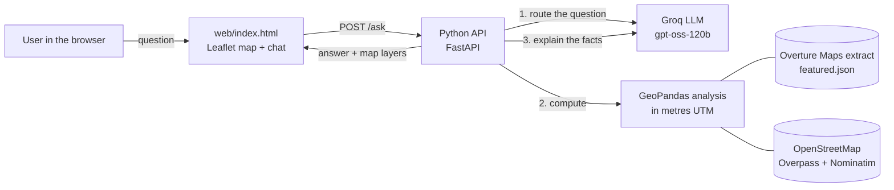

# GeoMind AI

**Ask in plain English how close schools are to healthcare — anywhere with open map data — and get an answer computed with GIS and drawn on a map.**

> "Which schools are more than 2 km from a medical facility?"
> "Which areas have poor access to healthcare?"
> "Which clinics are near me?"

GeoMind AI turns questions like these into real spatial analysis. An AI model reads the question and picks the right analysis; Python and GeoPandas compute the answer from open map data; the map shows buffers, coverage gaps and the most underserved schools.

- **Live app:** https://geomind-ai-geomind-ai-staging.static.hf.space
- **API docs:** https://geomind-api-fli0.onrender.com/docs

> The API runs on a free hosting tier that sleeps when idle — the first request after a quiet period can take up to a minute while it wakes up.

---

## Why

Where a new clinic, school nurse programme or ambulance post should go depends on distance: which schools are far from care, and which parts of a district have none nearby. That analysis normally needs GIS software and a specialist. GeoMind AI lets anyone ask it in a sentence and see the result on a map.

## What it does

| You can… | Example |
|---|---|
| Pick a featured district or search any place | Ghirnatah (Riyadh), Gulberg (Lahore), Clifton (Karachi), or any searched area |
| Count and list schools, medical facilities or hospitals | "How many hospitals are in Gulberg, Lahore?" |
| Find places within / beyond a distance (buffers) | "Which schools are more than 3 km from a medical facility?" |
| Measure from a map pin, your location or the area centre | "Which healthcare facilities are closest to me?" |
| Map coverage gaps | "Which areas have schools but no medical facility within 2 km?" |
| See a distance map of the whole area | "How far is the nearest school from each neighbourhood?" |
| Get an area summary | "Are there enough schools in this neighbourhood?" |

Every answer shows the exact analysis that ran (for example `find(target=schools, relation=beyond, distance_m=3000)`), so results are traceable.

## How it works



1. **Route.** The AI converts the question into one of five analysis blocks, as JSON.
2. **Compute.** Python runs that analysis with GeoPandas — distances in metres, buffers, spatial joins, polygon overlays.
3. **Explain.** The AI turns the computed facts into one to three sentences. It is only given those facts, so it cannot invent numbers, names or data sources.

If the AI is unavailable (no key, network issue or free-tier rate limit), a keyword router and the computed text take over, so the app still answers. See [docs/ai-design.md](docs/ai-design.md) and [docs/architecture.md](docs/architecture.md).

### The five analysis blocks

| Block | What it computes | GIS operations |
|---|---|---|
| `find` | List or count places, optionally within/beyond a distance from facilities, schools, a pin, the user or the centre | `sjoin_nearest`, point distances |
| `coverage` | Parts of the area farther than a distance from healthcare, and the schools inside them | `buffer` → `union_all` → `difference` |
| `distance_grid` | A grid of squares coloured by distance to the nearest school or facility | grid build, `within`, `sjoin_nearest`, quantile classes |
| `summary` | Area size, counts, densities, average and farthest school-to-facility distance | `area`, `sjoin_nearest` |
| `unsupported` | Polite refusal for off-topic questions | — |

## Repository layout

```
api/
  app.py               FastAPI routes: /health, /featured, /area, /ask
  geomind/data.py      loading areas: featured extracts, live OpenStreetMap, geocoding
  geomind/analysis.py  the five analysis blocks (GeoPandas)
  geomind/ai.py        AI routing, guard rails, keyword fallback, grounded explanations
  geomind/draw.py      turns results into map layers
  geomind/suggest.py   suggested questions from each area's data
  requirements.txt
web/index.html         the web app (map, search, chat) — display only
data/featured.json     prebuilt Overture Maps extracts for the featured districts
scripts/               make_featured.py (rebuild data), deploy_web.ps1
tests/                 pytest suite
docs/                  architecture and AI design notes
render.yaml            API hosting blueprint
```

## Run it locally

Requirements: Python 3.12.

```bash
git clone <this repo>
cd geomind-api
python -m venv .venv
.venv\Scripts\activate          # macOS/Linux: source .venv/bin/activate
pip install -r requirements-dev.txt
```

Optional: copy `.env.example` to `.env` and add a free Groq key from https://console.groq.com/keys. Without a key the app uses its keyword router.

Start the API and the web page in two terminals:

```bash
cd api && python app.py                                      # API on http://127.0.0.1:7860
python -m http.server 8770 --bind 127.0.0.1 --directory web  # page on http://127.0.0.1:8770
```

Open http://127.0.0.1:8770 — the page detects it is running locally and talks to the local API.

### Tests

```bash
pytest
```

The suite checks the analyses against measured values (for example Gulberg: 79 schools, 59 medical facilities, 43 schools within 250 m; Ghirnatah: 39% of the area more than 500 m from a facility), the AI guard rails, the keyword fallback on 18 real tester questions, and every API flow.

## Deployment

- **API → Render (free):** New → Blueprint → select this repo (`render.yaml`), then add `GROQ_API_KEY` in the service's Environment settings.
- **Web page → Hugging Face Static Space (free):** `scripts/deploy_web.ps1` (defaults to the staging Space).

## Limitations

- **Open-data coverage varies.** OpenStreetMap had 3 medical facilities in Ghirnatah where Overture Maps had 16; some places are labelled inconsistently (a few training centres are tagged as schools). The app always names its data source and warns when an area has too little data.
- **Free tiers.** The API sleeps when idle; the Groq free tier rate-limits rapid questions (the keyword fallback keeps answering); public Overpass servers can be slow, so live areas can take up to 25 s to load.
- **Distance is straight-line**, not travel time along roads.
- **No official benchmarks.** "Enough schools" is answered with densities and distances, not a standard the data doesn't contain.

## Data sources and attribution

- Map data © [OpenStreetMap contributors](https://www.openstreetmap.org/copyright), available under the Open Database License (ODbL), via the Overpass API and Nominatim.
- Places data from [Overture Maps Foundation](https://overturemaps.org) (featured districts).
- Basemaps: Esri World Light Gray / Dark Gray Canvas.
- Search suggestions: [Photon](https://photon.komoot.io) by komoot. Geocoding by [Nominatim](https://nominatim.org) — used within its usage policy (identifying User-Agent, low request rate).
- Language model: [Groq](https://groq.com), `openai/gpt-oss-120b`.

## Team

GeoMind AI team — add member names here.

## License

Code: [MIT](LICENSE). Map data keeps its own licenses, listed above.
