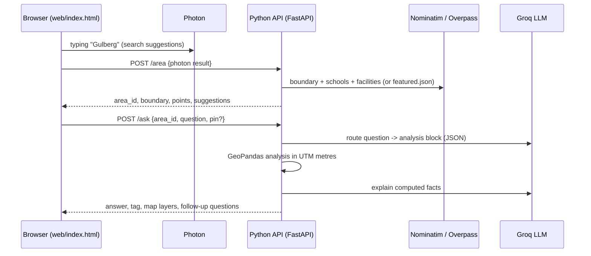

# Architecture

GeoMind AI has two parts: a **web page** that only displays things, and a **Python API** that does all the work.

## Web page (`web/index.html`)

- Leaflet map with Esri light/dark basemaps, a search bar, a floating chat and a legend.
- Photon search suggestions are fetched directly by the browser so typing feels instant.
- The browser's location is read only when the API asks for it (`needs_location`) for "near me" questions.
- It draws answers from `draw.layers`: each layer has a **role** (`buffer`, `hit_within`, `gap`, `grid`, …) and the page only chooses theme colours for roles. Switching dark/light mode re-colours the map without touching the chat.

## Python API (`api/`)

| Route | Purpose |
|---|---|
| `GET /health` | Wake-up and status check (also reports whether AI is configured) |
| `GET /featured` | Featured districts |
| `POST /area` | Load an area from a featured key, a search result, or a point |
| `POST /ask` | Answer a question: route → compute → explain → map layers |

### Loading areas (`geomind/data.py`)

- **Featured districts** come from `data/featured.json`, an Overture Maps extract clipped to each district boundary and de-duplicated (built by `scripts/make_featured.py`).
- **Any other area**: boundary from Nominatim `lookup` (or the search result's bounding box), schools and medical facilities from Overpass. All three public Overpass mirrors are queried in parallel and the first answer is used. Points are clipped to the boundary and facilities within 75 m of each other are merged.
- **"Near me"**: Nominatim `reverse` finds the user's neighbourhood (or a 1.5 km box around them); featured districts are recognised automatically.
- Loaded areas are cached in memory by `area_id`.

### Analysis (`geomind/analysis.py`)

Each area is projected to its UTM zone (`estimate_utm_crs`) so distances are in metres.

- `find`: `sjoin_nearest` between the target set and the reference set (with `exclusive=True` when a set is compared with itself), or distances to a single point; filtered, sorted and limited.
- `coverage`: buffers around every facility are merged with `union_all`; the gap is the district boundary minus that union. Percentages come from exact polygon areas.
- `distance_grid`: about 600 squares across the district; each square's centre is joined to its nearest target; classes use rounded quantiles.
- `summary`: area, counts, densities, average and farthest school-to-facility distance.

Default distances adapt to each area (the median school-to-facility distance, rounded up): 500 m in Ghirnatah, 250 m in dense Gulberg.

## Security and limits

- The Groq key lives only in the host's environment settings (never in the repo or the page).
- CORS allows only the app's own web addresses.
- A per-visitor limit (20 questions and 30 area loads per minute) protects the free AI quota.
